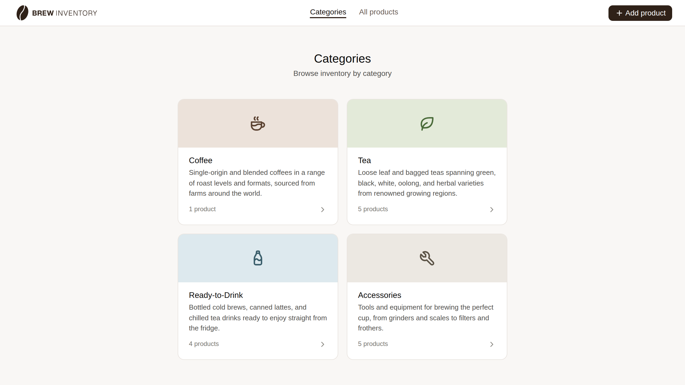
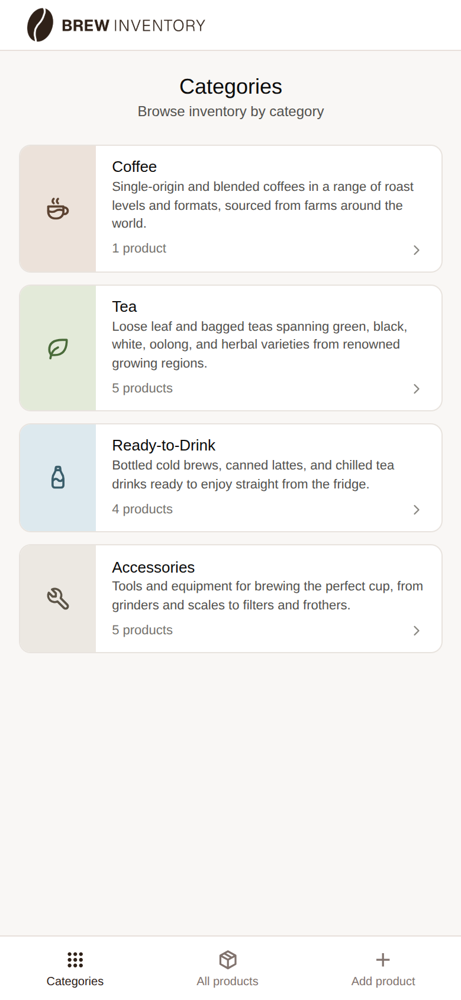
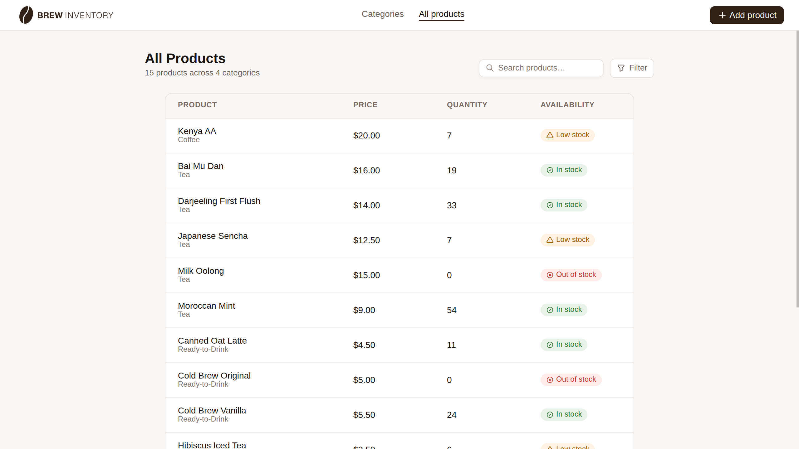
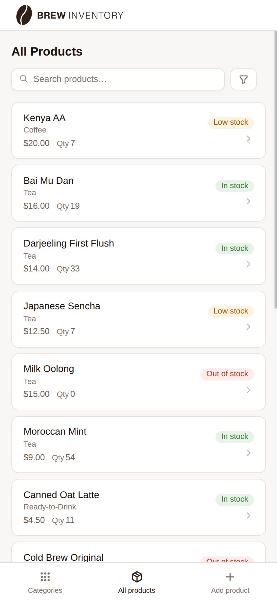
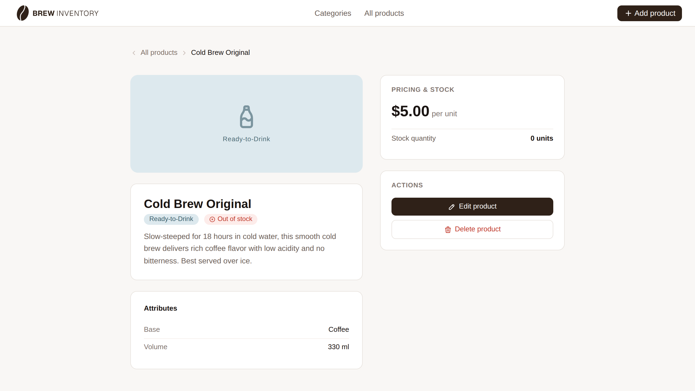
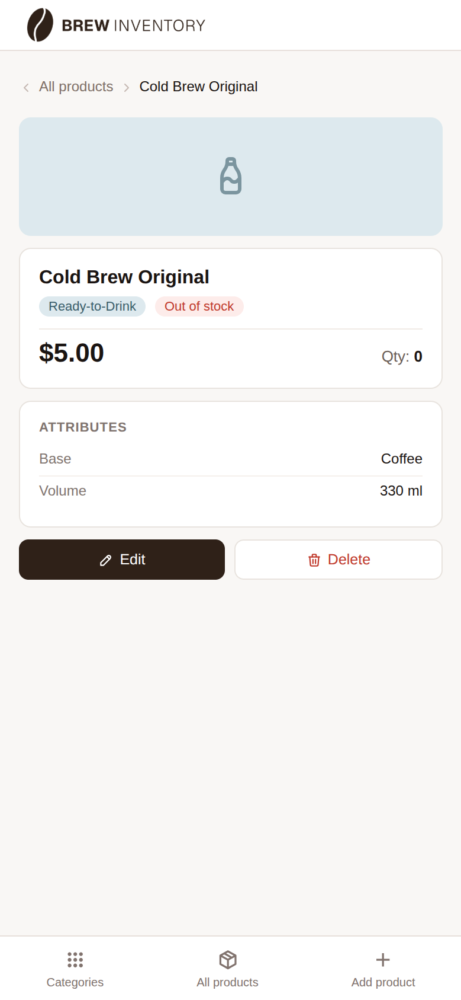

# Brew Inventory — Client

React frontend for Brew Inventory, a full-stack inventory management app for a specialty tea and coffee store.

> **Work in progress.** Deployment coming soon.

## Related repository

[brew-inventory-server](https://github.com/Maddily/brew-inventory-server) — Express/PostgreSQL API

## Features

- Browse inventory by category or view all products at once
- Filter products by category, availability and product attributes
- Search products by name
- Add, edit, and delete products with category-specific attribute fields
- Availability status derived from stock quantity (in stock / low stock / out of stock)
- Fully responsive: mobile bottom navigation, desktop top navigation
- Accessible markup throughout

## Admin access

To edit or delete products, enter the admin password when prompted:

**Password:** `brew123`

## Screenshots

### Categories




### Products




### Product detail




## Tech stack

- **React** with **Vite**
- **React Router** for client-side routing

## Views

| Route                | Component     | Description                                |
| -------------------- | ------------- | ------------------------------------------ |
| `/`                  | `Categories`  | Grid of all categories with product counts |
| `/products`          | `Products`    | Full product list with search and filter   |
| `/categories/:id`    | `Products`    | Products filtered by category              |
| `/products/:id`      | `Product`     | Single product detail with attributes      |
| `/products/new`      | `AddProduct`  | Add a new product                          |
| `/products/:id/edit` | `EditProduct` | Edit an existing product                   |

## Project structure

```
└── 📁brew-inventory-client
    └── 📁public
        ├── apple-touch-icon.png
        ├── favicon-96x96.png
        ├── favicon.ico
        ├── favicon.svg
        ├── icons.svg
        ├── robots.txt
        ├── site.webmanifest
        ├── web-app-manifest-192x192.png
        ├── web-app-manifest-512x512.png
    └── 📁screenshots
        ├── categories-desktop.png
        ├── categories-mobile.png
        ├── product-detail-desktop.png
        ├── product-detail-mobile.png
        ├── products-desktop.png
        └── products-mobile.png
    └── 📁src
        └── 📁assets
            ├── logo.png
        └── 📁components
            └── 📁BottomNav
                ├── BottomNav.jsx
                ├── BottomNav.module.css
                ├── BottomNav.test.jsx
            └── 📁BottomNavLink
                ├── BottomNavLink.jsx
                ├── BottomNavLink.module.css
                ├── BottomNavLink.test.jsx
            └── 📁Breadcrumb
                ├── Breadcrumb.jsx
                ├── Breadcrumb.module.css
                ├── Breadcrumb.test.jsx
            └── 📁FieldError
                ├── FieldError.jsx
                ├── FieldError.module.css
                ├── FieldError.test.jsx
            └── 📁FormError
                ├── FormError.jsx
                ├── FormError.module.css
                ├── FormError.test.jsx
            └── 📁Header
                ├── Header.jsx
                ├── Header.module.css
                ├── Header.test.jsx
            └── 📁NavLink
                ├── NavLink.jsx
                ├── NavLink.module.css
                ├── NavLink.test.jsx
            └── 📁ProductForm
                ├── ProductForm.jsx
                ├── ProductForm.module.css
                ├── ProductForm.test.jsx
        └── 📁hooks
            ├── useAvailability.jsx
            ├── useAvailability.test.jsx
            ├── useIsWide.js
            ├── useIsWide.test.js
            ├── useSections.js
            ├── useSections.test.js
        └── 📁pages
            └── 📁addProduct
                └── 📁components
                    └── 📁AddProduct
                        ├── AddProduct.jsx
                        ├── AddProduct.test.jsx
            └── 📁categories
                └── 📁components
                    └── 📁Categories
                        ├── Categories.jsx
                        ├── Categories.module.css
                        ├── Categories.test.jsx
                    └── 📁Category
                        ├── Category.jsx
                        ├── Category.module.css
                        ├── Category.test.jsx
                    └── 📁SkeletonCategories
                        ├── SkeletonCategories.jsx
                        ├── SkeletonCategories.module.css
            └── 📁editProduct
                └── 📁components
                    └── 📁EditProduct
                        ├── EditProduct.jsx
                        ├── EditProduct.test.jsx
                    └── 📁SkeletonEditProduct
                        ├── SkeletonEditProduct.jsx
                        ├── SkeletonEditProduct.module.css
            └── 📁error
                └── 📁components
                    └── 📁ErrorState
                        ├── ErrorState.jsx
                        ├── ErrorState.module.css
                        ├── ErrorState.test.jsx
            └── 📁productDetail
                └── 📁components
                    └── 📁DeleteModal
                        ├── DeleteModal.jsx
                        ├── DeleteModal.module.css
                        ├── DeleteModal.test.jsx
                    └── 📁ProductDetail
                        ├── ProductDetail.jsx
                        ├── ProductDetail.module.css
                        ├── ProductDetail.test.jsx
                    └── 📁SkeletonProductDetail
                        ├── SkeletonProductDetail.jsx
                        ├── SkeletonProductDetail.module.css
            └── 📁products
                └── 📁components
                    └── 📁FilterBottomSheet
                        ├── FilterBottomSheet.jsx
                        ├── FilterBottomSheet.module.css
                        ── FilterBottomSheet.test.jsx
                    └── 📁FilterDropdown
                        ├── FilterDropdown.jsx
                        ├── FilterDropdown.module.css
                        ├── FilterDropdown.test.jsx
                    └── 📁FilterEmptyState
                        ├── FilterEmptyState.jsx
                        ├── FilterEmptyState.module.css
                    └── 📁FilterSection
                        ├── FilterSection.jsx
                        ├── FilterSection.module.css
                        ├── FilterSection.test.jsx
                    └── 📁Product
                        ├── Product.jsx
                        ├── Product.module.css
                        ├── Product.test.jsx
                    └── 📁ProductEmptyState
                        ├── ProductEmptyState.jsx
                        ├── ProductEmptyState.module.css
                        ├── ProductEmptyState.test.jsx
                    └── 📁ProductRow
                        ├── ProductRow.jsx
                        ├── ProductRow.module.css
                        ├── ProductRow.test.jsx
                    └── 📁Products
                        ├── Products.jsx
                        ├── Products.module.css
                        ├── Products.test.jsx
                    └── 📁ProductsTable
                        ├── ProductsTable.jsx
                        ├── ProductsTable.module.css
                        ├── ProductsTable.test.jsx
                    └── 📁SearchBar
                        ├── SearchBar.jsx
                        ├── SearchBar.module.css
                        ├── SearchBar.test.jsx
                    └── 📁SheetChip
                        ├── SheetChip.jsx
                        ├── SheetChip.module.css
                        ├── SheetChip.test.jsx
                    └── 📁SkeletonProducts
                        ├── SkeletonProducts.jsx
                        ├── SkeletonProducts.module.css
        └── 📁router
            ├── routes.jsx
        └── 📁styles
            ├── App.css
            ├── normalize.css
        └── 📁utils
            ├── filterUtils.js
            ├── filterUtils.test.js
            ├── utils.js
            ├── utils.test.js
        ├── App.jsx
        ├── constants.js
        ├── contexts.js
        ├── main.jsx
    ├── eslint.config.js
    ├── index.html
    ├── package.json
    ├── README.md
    └── vite.config.js
```

## Getting started

### Prerequisites

- Node.js
- The [brew-inventory-server](https://github.com/Maddily/brew-inventory-server) running locally

### Setup

1. Clone the repository

```bash
git clone https://github.com/Maddily/brew-inventory-client.git
cd brew-inventory-client
```

2. Install dependencies

```bash
npm install
```

3. Start the development server

```bash
npm run dev
```

The app will be running at `http://localhost:5173`.

> Make sure the API server is running at `http://localhost:3000` before using the app.
